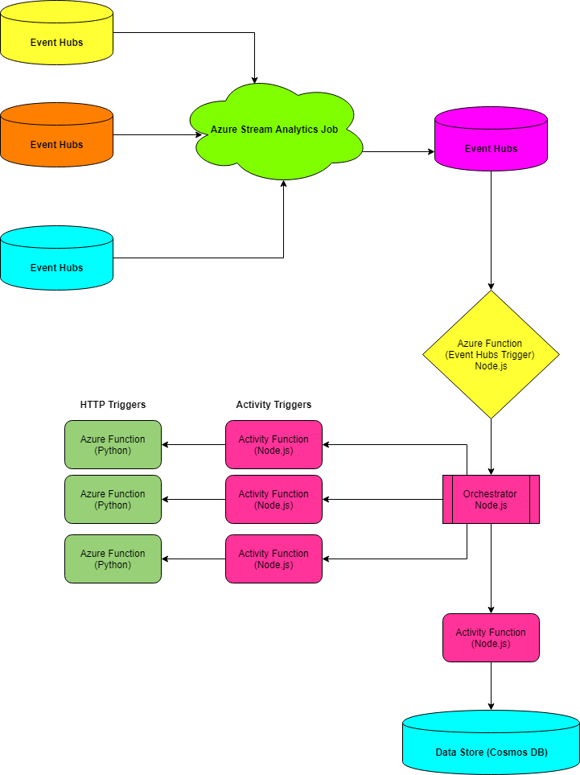
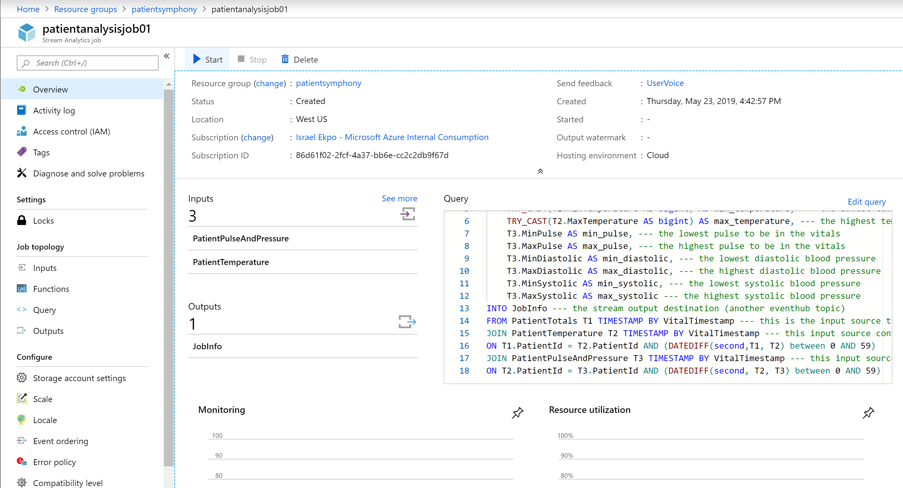

## Background Story
This tutorial demonstrates how to use Durable functions written in JavaScript (Node.js) in collaboration with Azure Functions written in Python to process data with Azure Event Hubs and Azure Stream Analytics.

Data arrives into 3 Event Hubs and we use a Stream Analytics job to query the different data sources to extract the fields we need and drop the consolidate record into a new EventHub. As events are arriving at this destination EventHub, it is triggering a JavaScript function that then triggers a durable function (Node.js).

The Durable function picks up each event (record) from EventHub as it arrives and sends it over to an Activity Function (Node.js) that serves as a proxy and passes it to the corresponding Azure Function (Python). The output from this function is then passed back to the JavaScript Activity function that sends it into the Orchestrator.

There are three more calls to activity functions that are also serving as proxies to the real Python functions doing the real work and their outputs are retrieved by the activity functions and passed back into the Orchestrator. Each of these activity functions are using the output from the first function call to do their work.

The final output is collected in the orchestrator and sent to a Scoring function who has the option of writing the records to a datastore such as Cosmos DB or Azure SQL Database.

There are CLI commands and ARM templates so simplify the provisioning of resources that are dependencies.

There is also a helper utility program written in C# .NET 2.2 to help with generating the sample event hub messages.

```shell
Data Generator --> Event Hubs --> Stream Analytics --> Event Hubs -> Trigger Function --> Orchestrator Function --> Activity Functions --> Orchestrator Function --> Scoring Service --> Data Stores 
```



## Installing Resources
This tutorial assumes you have already installed Python 3.6.8 (or a later version in the 3.6.x series), Node.js 10.15.3 or later and .NET CORE SDK 2.2

You can get these dependencies here:

https://www.python.org/downloads/release/python-368/

https://nodejs.org/en/download/

https://dotnet.microsoft.com/download

```shell

npm install -g azure-functions-core-tools
npm install -g durable-functions

pip install azure-functions
pip install pylint

```

## Setting Up Pre-Requisites for the Project

To deploy the code to azure we will need to set up a few resources such as a storage account, app-insights component/key etc

### Step 1a - Login into your Azure Account
```shell
az login
```

### Step 1b - View your tenant id and current subscription id
```shell
az account show -o table
```

### Step 1c - View all the subscriptions you have access to 
```shell
az account list -o table
```

### Step 1d - This extension provides the App Insights Extension to your CLI
```shell
az extension add --name application-insights
```

### Step 1e This extension provides a preview for upcoming storage features
```shell
az extension add --name storage-preview
```

### Step 2 Specify the subscription, you would like to use for this project 
```shell
az account set --subscription "01231f02-2fcf-4a37-bb6e-cc2c2db9f67d"
```

### Step 3 List all the available locations or regions for your account. For this tutorial, we will use the West US (westus) region 

```shell
az account list-locations -o table
```

### Step 4 Let's create a resource group for our project in one of the available locations

```shell
az group create --name patientsymphony --location westus
```

### Step 5a - Create a Storage Account in the Same Region and Resource Group
```shell
az storage account create --name patientstorage033 --location westus --resource-group patientsymphony --sku Standard_LRS
```

### Step 5b - Retrieve the Storage Account Key

This will be needed by the function apps for local testing

```shell
az storage account show-connection-string --resource-group patientsymphony --name patientstorage033
```

### Step 6a Create the App Insights Component
```shell
az monitor app-insights component create --app patientmonitor03 --location westus --resource-group patientsymphony --kind web --application-type web
```
		
### Step 6b Create the API Key
```shell
az monitor app-insights api-key create --app patientmonitor03 --api-key patientstreams03key --resource-group patientsymphony
```

## Python Function CORE App

Fetch the Python Function code from git

```shell
git clone git@github.com:izzymsft/PatientCore.git
```

After cloning the code, please navigate to the project folder and run the following commands to install some dependencies needed for development:

```shell
cd PatientCore

func extensions install
```

### Step 1 - Create the Function App

For the consumption plan locations, use "az functionapp list-consumption-locations -o table" to find out available locations

```shell
az functionapp create --name patientcore01 --resource-group patientsymphony --app-insights patientmonitor03 --app-insights-key patientstreams03key --storage-account patientstorage033 --consumption-plan-location westus --runtime python --os-type Linux
```

### Step 2 - Publish your App to Azure

Let's run the code locally on port 9090 and debug it locally before publishing it to Azure

```shell
func host start --port 9090
```

```shell
func azure functionapp publish patientcore01
```


## Dependency Setup - We need to set up dependencies for our Node.js Function project (Eventhubs and Stream Analytics)

### Step 1 - Create the Event Hub Namespace

```shell
az eventhubs namespace create --resource-group patientsymphony --name patientevents03 --location westus --sku Standard --tags active=true csv=1 json=1 tsv=0 avro=0 
```

### Step 2 - Create the Input Event Hubs (pulsebp, temperature and totals)

```shell
az eventhubs eventhub create --resource-group patientsymphony --namespace-name patientevents03 --name pulsebp
az eventhubs eventhub create --resource-group patientsymphony --namespace-name patientevents03 --name temperature
az eventhubs eventhub create --resource-group patientsymphony --namespace-name patientevents03 --name totals
```

### Step 2b - Create the Output Event Hub where stream analytics will drop off the consolidated objects

```shell
az eventhubs eventhub create --resource-group patientsymphony --namespace-name patientevents03 --name jobinfo
```

### Step 3 - Create Consumer Groups for all 4 Event Hubs. This is needed by the Stream Analytics clients reading from Event Hub

```shell  
az eventhubs eventhub consumer-group create --resource-group patientsymphony --namespace-name patientevents03 --eventhub-name pulsebp --name stranalytics01

az eventhubs eventhub consumer-group create --resource-group patientsymphony --namespace-name patientevents03 --eventhub-name temperature --name stranalytics01

az eventhubs eventhub consumer-group create --resource-group patientsymphony --namespace-name patientevents03 --eventhub-name totals --name stranalytics01

az eventhubs eventhub consumer-group create --resource-group patientsymphony --namespace-name patientevents03 --eventhub-name jobinfo --name stranalytics01
```
		
### Step 4 - Retrieve the Connection Details for the Event Hub Namespace. 

This is needed for the .NET CORE Code that generates sample events into EventHubs as well as the connection to EventHub from Stream Analytics.

```shell
az eventhubs namespace authorization-rule keys list --name RootManageSharedAccessKey --resource-group patientsymphony --namespace-name patientevents03 
```

### Step 5 - Set up the Stream Analytics Job

You will need to sharedAccessPolicyKey from your EventHubs resources for the deployment parameters file

The JSON Schema for this ARM Template is available here:

https://raw.githubusercontent.com/Azure/azure-resource-manager-schemas/master/schemas/2016-03-01/Microsoft.StreamAnalytics.json

Fetch the ARM templates for deploying the Stream Analytics Job via ARM Templates and run the deployment to create the job

```shell

git clone git@github.com:izzymsft/PatientResources.git

cd PatientResources

az group deployment create --name "patient-stream-job--deployment-001" --resource-group "patientsymphony" --template-file "stream-analytics-deployment-01.json" --parameters "@stream-analytics-deployment-parameters-01.json"

```

Once the deployment is complete, please log into the portal and start the Stream Analytics job, by clicking the "Start" button for the job.



## Run the following .NET Core Console App to Generate Some Events into Event Hubs

The Console app here generates messages to event hub that will trigger the Javascript function

https://github.com/izzymsft/PatientStreamSource/blob/master/Program.cs

Setting the "byPass" variable to true writes messages directly to the Event Hub that triggers the function

Setting the "byPass" variable to false writes the messages into 3 event hubs that are transformed by the Stream Analytics job into a consolidated object the goes into the final event hub which triggers our functions to kick off the orchestration for each event hub message.

You will need your appsettings.json file with the config values similar to the following

```json
{
    "Logging": {
      "LogLevel": {
        "Default": "Warning"
      }
    },
    "ConnectionStrings": {
        "EventHubConnection": "Endpoint=sb://patientevents03.servicebus.windows.net/;SharedAccessKeyName=RootManageSharedAccessKey;SharedAccessKey=j12345YTu9yeTe3zmSbDYLTHCWLa9HsFK/Za0mkJyhs=",
        "EventHubNamePulseAndPressure": "pulsebp",
        "EventHubNameTemperature": "temperature",
        "EventHubNameTotals": "totals",
        "EventHubNameJobInfo" : "jobinfo"
    }
}

```

```shell

# Grab the code
git clone git@github.com:izzymsft/PatientStreamSource.git

# Navigate to code root folder
cd PatientStreamSource

# Fetch all the dependencies if necessary
dotnet restore

# Check if the compilation works
dotnet build

# Compile and run the code to generate the messages
dotnet run

```

## Node.js JavaScript Trigger Functions, Orchestrators and Activity Functions

Check out the Patient Orchestra Javascript Function Project. Make sure your JavaScript functions are pointing correctly to the Python functions using the correct app names. Also ensure that you are using the correct storage accounts and event hub connection strings.

```shell
git clone git@github.com:izzymsft/PatientOrchestra.git

Navigate to the root folder and install node modules that you may not have already installed.

cd PatientOrchestra

npm install -g azure-functions-core-tools

npm install -g durable-functions

func extensions install

```

### Step 1 - Create the Function App for the Node.js JavaScript Functions

```shell
az functionapp create --name patientorchestra01 --resource-group patientsymphony --app-insights patientmonitor03 --app-insights-key patientstreams03key --storage-account patientstorage033 --consumption-plan-location westus --runtime node, --os-type Linux
```

### Step 2 - Publish your App to Azure

Let's run the code locally on port 9090 and debug it locally before publishing it to Azure

```shell
# This starts the function on a port different from the default 7071

func host start --port 9090
```

```shell
# This uploads the local function code to Azure and makes it available from the Consumption plan
func azure functionapp publish patientorchestra01

```

You can continue to trigger more processing by running the data generator logic that writes new events into EventHubs:

```shell
# Grab the code
git clone git@github.com:izzymsft/PatientStreamSource.git

# Navigate to code root folder
cd PatientStreamSource

# Fetch all the dependencies if necessary
dotnet restore

# Check if the compilation works
dotnet build

# Compile and run the code to generate the messages
dotnet run
```
